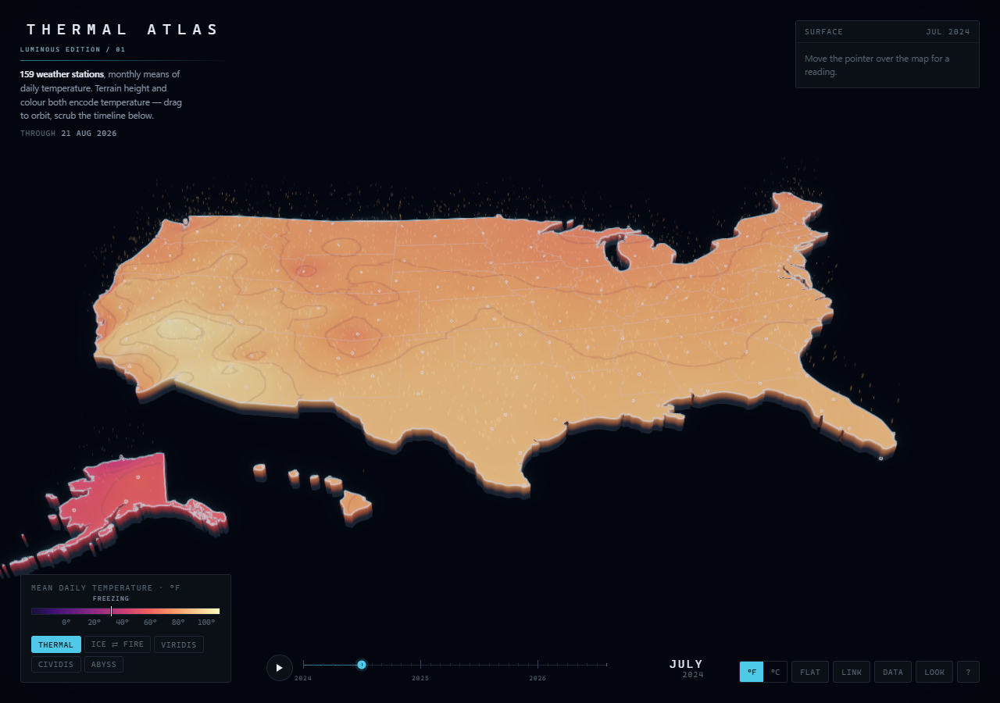

# Thermal Atlas — Luminous edition

An interactive US temperature atlas that turns monthly temperatures into a luminous, sculpted surface. Explore the record, compare places, and adjust the atmosphere while keeping the underlying temperature values intact.

**Start here:** open [temp_viz.enhanced.html](temp_viz.enhanced.html) in a WebGL2-capable browser. No installation, npm dependencies, server, or frontend build is required to use the app.



## What the app does

- Adds **My places** city/state search over the existing sampling locations; choosing a result pins it and brings it into view.
- Adds **Compare**: two independently selected months rendered through the same camera, a draggable A/B divider, and exact B-minus-A readings for pinned locations.
- Renders temperature as both surface height and color. The relief represents temperature, not geographic elevation.
- Plays and scrubs a monthly time series, with interpolated transitions between months.
- Supports five palettes: Thermal, Ice–Fire, Viridis, Cividis, and Abyss.
- Shows a surface temperature readout and a station sparkline on hover.
- Pins up to four locations for comparison, using consistent pin colors across the map and charts. Adding a fifth replaces the oldest pin.
- Switches between Fahrenheit and Celsius, or between relief and flat views.
- Provides a sortable station table with year tabs and partial-month indicators.
- Saves the month, camera, palette, units, contours, pins, and appearance settings in the URL fragment.
- Offers **Look** controls for Radiance, Atmosphere, and Flow, plus ambience pause and reset.
- Works with the embedded dataset offline and attempts an online historical-data update when network access is available.

The thermal streaks are an artistic interpretation of convection, not measurements of wind or air movement.

## Personal discoveries

1. Open **My places** and type a city, state abbreviation, or state name. Choose a result to pin and visit that actual sampling location. Selecting it again revisits without unpinning it. Search never substitutes a different city or requests geolocation.
2. Add a second meaningful place, then select **Compare**. The defaults are January and July in the current record year when both are available.
3. Choose month **A (left)** and **B (right)**. Drag the A/B divider to reveal each view. Focus the divider and use arrows for 2% steps, Shift-arrows for 10%, or Home/End for the limits. **50 / 50** centers it.
4. Read the pinned comparison card: A, B, and Δ = B − A in the current temperature units. An asterisk identifies a partial month. The camera, palette, and temperature scale are shared; each month's temperature-dependent relief remains visible.
5. **Done** returns to normal exploration at month A, keeping pins and camera. Timeline playback is suspended while comparing. Link includes the selected month keys and divider position.

Search input supports Enter to choose the first match and Arrow Down to focus results. Results support arrow navigation, Home/End, native Enter/Space activation, and Escape to close the panel.

## Controls

| Action | Control |
| --- | --- |
| Orbit | Drag; arrow keys or W/A/S/D |
| Pan | Shift-drag or right-drag |
| Zoom | Wheel or touch pinch; Q/E or minus/plus |
| Read a location | Hover over the map or a station |
| Pin/unpin | Click a station; P for the hovered station |
| Clear pins | X or the pin card's Clear button |
| Play/pause the record | Play button or Space |
| Scrub time | Drag the timeline |
| Step half a month | Comma / period |
| Step a whole month | Left/right arrows while the timeline is focused |
| First/last month | Home/End while the timeline is focused |
| Reset camera | R |
| Flat/relief | Flat button or F |
| Toggle contours | I |
| Switch units | F/C buttons or C |
| Select palette | Palette buttons or keys 1–5 |
| Data table | Data button or T |
| Help | ? button or H |
| Close a panel | Close button or Escape |
| Adjust visual layers | Look button |
| Copy current view | Link button |
| Search and pin a place | My places |
| Compare two months | Compare; drag the divider or use its arrow keys |
| Exit comparison | Done or Compare |

**Pause ambience** freezes decorative particle motion and the grain clock. It is separate from timeline playback. Reduced-motion preferences disable automatic ambience and startup playback; Resume ambience explicitly enables decorative motion again.

**Sharing:** Link preserves view settings, not a data snapshot. A `file://` URL refers to a local path and is not a public share link. Another person needs a compatible copy of the HTML at that path, or a hosted version of the page. Later live-data updates can change the values shown by the same view settings.

## Data and interpretation

The baked payload contains 159 sampling locations, called stations in the interface, and 32 monthly entries from January 2024 through August 2026. Its displayed coverage ends on 21 August 2026; the last month is partial. Online updates may extend that range.

The page attributes its source to ERA5/ERA5T through the [Open-Meteo historical archive](https://open-meteo.com/en/docs/historical-weather-api). Historical archive data are gridded model/reanalysis estimates, so the station terminology should not be read as a guarantee of direct instrument observations at every point.

The rendered surface is an inverse-distance-weighted estimate using ten nearby locations on a 300 × 166 grid. Alaska, Hawaii, and Puerto Rico use separate interpolation regions so their inset positions do not mix them with mainland samples. The temperature domain is fixed at initialization to keep the baked record comparable across months. Displayed contours mark multiples of 5 °F even when readouts use Celsius.

The inherited updater requests recent daily temperatures and aggregates them by month. Live updating and its accuracy were not verified during the visual enhancement pass. For repeatable visual comparisons, use the baked data with updates disabled, as the test runner does.

## Project structure

| Path | Purpose |
| --- | --- |
| `temp_viz.enhanced.html` | Current enhanced app: markup, CSS, embedded data, JavaScript, and GLSL shaders |
| `temp_viz.html` | Preserved working version before enhancements |
| `temp_viz_original.html` | Earlier original version |
| `temp_viz.backup.html` | Byte-identical copy of the earlier original |
| `archive/temp_viz.2026-09-13.baseline.html` | Verified snapshot used to generate the enhanced edition |
| `archive/temp_viz.iteration-01.html` | Preserved enhanced edition before My places and Compare |
| `review/experience.cjs` | Reproducible My places and comparison additions |
| `review/verify-experience.cjs` | Search, arithmetic, divider, and sharing checks |
| `review/build-enhanced.cjs` | Reproducible transformations from baseline to enhanced HTML |
| `review/verify-enhanced.cjs` | Browser interaction and rendering checks |
| `review/*.png` | Visual review screenshots |
| `review/thermal-enhanced-verification.json` | Recorded test result and renderer metadata |
| [ENHANCEMENT_PLAN.md](ENHANCEMENT_PLAN.md) | Initial code review and visual roadmap |
| [ITERATION_01.md](ITERATION_01.md) | Implemented changes and verification scope |

## How the code works

The application is a single HTML file with no runtime library dependencies. Its JavaScript is organized into labeled sections inside an immediately invoked function.

1. **Decode and prepare data.** Read the embedded `mapdata` JSON and decode compressed geometry and temperature arrays. Build the monthly axis, location metadata, and temperature domain.
2. **Build the thermal field.** `buildRegions()` isolates inset regions; `buildWeights()` caches neighboring locations and spatial weights; `computeField()` blends monthly samples. `sampleField()` supplies CPU-side readings for picking and charts.
3. **Build geometry.** `subdivide()` refines terrain triangles; the land raster supports picking and boundary classification. Instanced ribbons draw borders and the extruded coastline.
4. **Render the scene.** Custom WebGL2 shaders draw the surface, coastline, boundaries, stations, and 4,200 seeded thermal particles. `sunFor()` drives seasonal lighting; the atmosphere models height-dependent attenuation. The palette is decoded from sRGB for linear-light shading.
5. **Finish the image.** A separate emission attachment supplies selective bloom at two resolutions. The composite shader applies FXAA edge smoothing, an ACES-style tone curve, sRGB output encoding, and restrained grain/vignette. Scene targets use floating-point color where supported, with an RGBA8 fallback.
6. **Manage interaction.** Pointer and keyboard handlers control the camera, timeline, and pins. `paintLook()` manages appearance controls. `encodeState()` and `readState()` serialize and restore the view. `frame()` advances state and submits drawing commands.

`window.__dbg` exposes inspection helpers for the field, camera, pins, appearance, and graphics state. It is intended for local development and verification.

## Development and verification

To regenerate the enhanced HTML from the archived baseline:

```sh
node review/build-enhanced.cjs
```

This replaces `temp_viz.enhanced.html`. Make reproducible changes in the builder, or update it alongside direct edits to the generated HTML. It validates the baseline hash and checks that the embedded data were preserved.

To run browser checks:

```sh
node review/verify-enhanced.cjs
```

The runner requires Node 22+ and Chrome at the standard Windows Program Files location. It creates a temporary browser profile and writes screenshots/results inside `review/`.

The last enhancement run passed checks for shader initialization, emission targets, WebGL errors, all palettes, appearance controls, reduced motion, ambience pause/resume, pins, units, flat view, tables, shared state, mobile overflow, touch cancellation, and the RGBA8 fallback. Checks used headless Chrome with SwiftShader, a fixed random seed, and live fetching disabled. Hardware GPU performance and other browser/GPU combinations remain unmeasured. Iteration 02 also passed the search/comparison checks described in ITERATION_02.md.

## Experience roadmap

My places and Season comparison lens below are implemented in iteration 02. Capture a moment, journeys, journal, and sound remain proposed. The central sequence is **choose a place → discover a contrast → save the moment**.

| Priority | Addition | Experience and implementation direction |
| --- | --- | --- |
| 1 | **My places** | Search the existing location list and select a hometown, a place lived, or a destination. Fly gently to the chosen location and make pinning clear. Use explicit selection; location permission is unnecessary. Show the actual sample location when a requested city has no exact match. |
| 1 | **Season comparison lens** | Choose two months, then drag a split-view lens over the same map. Keep camera, scale, and palettes synchronized, show both dates, and report the actual change at pinned locations. Offer keyboard/buttons as well as dragging. |
| 1 | **Capture a moment** | Export a composed image with the chosen places, months, comparison, optional personal caption, source, and data-through date. Include a small replay file with view settings and the relevant data snapshot so a future live update cannot change the saved finding. |
| 2 | **Short discovery journeys** | Offer an optional, interruptible sequence such as “Follow the seasons” or “Compare two places.” Each chapter poses a question, lets the person act, and reveals a result computed from the record. Preserve a return-to-explore action. |
| 2 | **A personal observation journal** | Let people explicitly save named discoveries, thumbnails, and notes locally. Provide export/import and deletion; handle unavailable browser storage. Use snapshots rather than assuming a saved URL will always reproduce the same data. |
| 3 | **Optional sound** | Add user-enabled sonification with a stable, documented mapping from temperature to sound, gentle transition cues, and independent volume/mute. Keep every finding available visually and numerically. |

The next additive release would connect Capture a moment to the now-implemented My places and Season comparison lens. For example: choose two personally meaningful places, compare January with July, and leave with a titled postcard of the discovery. This creates a specific action and result to remember.

The emphasis on a rewarding reveal and a satisfying ending is informed by [NN/G's discussion of the peak–end rule](https://www.nngroup.com/articles/peak-end-rule/). These feature proposals are design hypotheses, not a guarantee of recall. Evaluate them by asking people later which places they compared, what they discovered, and whether their saved artifact helps them explain it—not simply by measuring time spent in the app.

For iteration 02 checks, run `node review/verify-experience.cjs`. The comparison renders two full scene passes; hardware GPU frame rate remains unmeasured. See [ITERATION_02.md](ITERATION_02.md).

